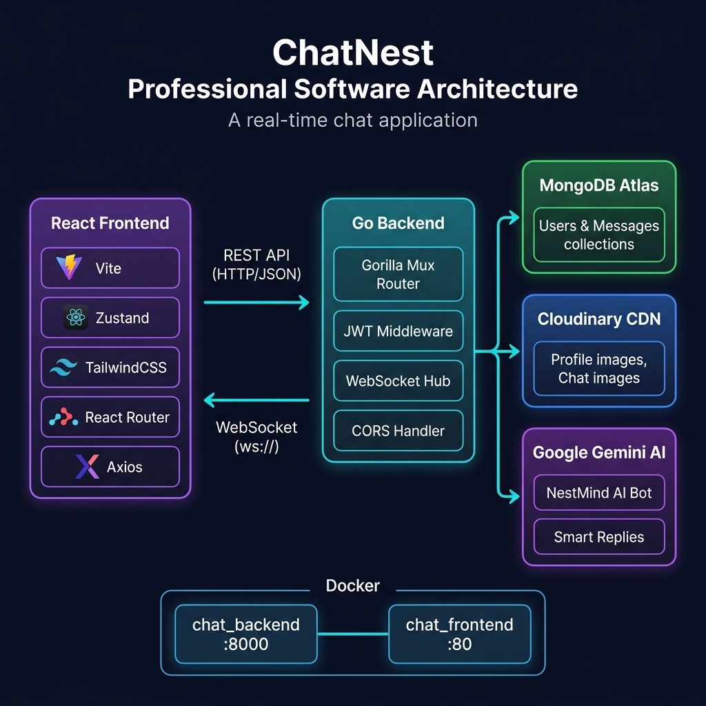
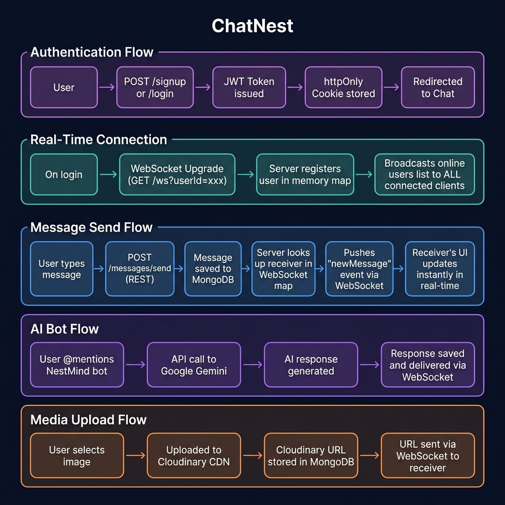

<div align="center">

# 📬 ChatNest

### High-Performance Real-Time Messaging with AI Intelligence

[](https://chatnest-3y2m.onrender.com/)
[](https://go.dev/)
[](https://react.dev/)
[](https://www.mongodb.com/atlas)
[](./docker-compose.yml)

[Report Bug](https://github.com/Hifzu04/chat_project/issues) · [Request Feature](https://github.com/Hifzu04/chat_project/pulls)

</div>

---

## 📋 Table of Contents

- [Overview](#-overview)
- [Product Requirements (PRD)](#-product-requirements-prd)
- [Key Features](#-key-features)
- [Tech Stack](#-tech-stack)
- [Architecture](#-architecture)
- [Workflow](#-workflow)
- [Project Structure](#-project-structure)
- [API Reference](#-api-reference)
- [Getting Started](#-getting-started)
- [Docker Deployment](#-docker-deployment)

---

## 📖 Overview

**ChatNest** is a production-ready, full-stack real-time messaging platform built with **Go** and **React 19**. It leverages native WebSockets for full-duplex communication and integrates the **Google Gemini AI** to power an intelligent in-chat assistant called **NestMind**.

The backend is engineered for concurrency using Go's goroutines, enabling it to handle thousands of simultaneous WebSocket connections efficiently. The frontend is a responsive SPA delivered through an Nginx container, with state managed globally via Zustand.

---

## 📄 Product Requirements (PRD)

### 1. Problem Statement

Modern users expect instant, reliable communication with zero perceptible latency. Existing solutions are either too heavyweight (Slack, Teams) or lack intelligent features (plain WhatsApp clones). ChatNest fills this gap by providing a lightweight, self-hostable messaging platform with first-class AI integration.

### 2. Goals

| Goal | Metric |
|---|---|
| Real-time message delivery | < 100ms end-to-end latency |
| Secure authentication | JWT with httpOnly cookies (XSS resistant) |
| Media sharing | Image upload & delivery via Cloudinary CDN |
| AI assistance | Integrated NestMind bot powered by Gemini API |
| Containerized deployment | Single `docker compose up` to run the full stack |

### 3. Non-Goals (Out of Scope)

- Group chats / channels (v2 roadmap)
- Voice or video calling
- End-to-end encryption (E2EE)
- Mobile native apps (iOS/Android)

### 4. User Stories

| As a... | I want to... | So that... |
|---|---|---|
| New user | Sign up with email & password | I can access the platform |
| Authenticated user | See who is online in real-time | I know who I can chat with immediately |
| User | Send text messages instantly | My friend receives them without refreshing the page |
| User | Share images in chat | I can communicate visually |
| User | Update my profile photo | My contacts can identify me |
| User | Ask NestMind for help | I can get AI assistance without leaving the chat |

### 5. Constraints

- All user passwords must be hashed using `bcrypt` before persistence.
- JWT tokens must expire and be stored in `httpOnly` cookies only.
- The backend must not expose the user's hashed password in any API response (`json:"-"`).
- All cross-origin requests must be validated against the allowed `FRONTEND_URL` environment variable.

---

## 🚀 Key Features

### 🧠 AI Edge — NestMind
- **Intelligent Bot:** An in-chat AI assistant (`@NestMind`) powered by **Google Gemini**.
- **Context-Aware Replies:** Responds within the context of your active conversation.
- **Summarization:** Catch up on long threads instantly.

### 💬 Real-Time Messaging
- **Native WebSockets:** Full-duplex, bidirectional communication via Go's `gorilla/websocket`.
- **Online Presence:** Real-time green dot indicators for who is currently online.
- **Instant Notifications:** Toast notifications for new messages via `react-hot-toast`.

### 📸 Media Sharing
- **Image Messages:** Send images directly in chat.
- **Cloudinary CDN:** All media is uploaded, optimized, and served via Cloudinary for fast global delivery.

### 🔐 Security & Auth
- **JWT Authentication:** Secure session management via `httpOnly` cookies, resistant to XSS attacks.
- **Protected Routes:** All sensitive endpoints guarded by JWT middleware on the backend and route guards on the frontend.
- **Password Hashing:** bcrypt used for all password storage.

### 🐳 Docker Ready
- Multi-stage Dockerfiles for minimal production images.
- Single `docker compose up --build` command to spin up the entire stack.

---

## 🛠 Tech Stack

| Layer | Technology | Purpose |
|---|---|---|
| **Frontend** | React 19 + Vite | UI framework & build tool |
| **Styling** | TailwindCSS v4 + DaisyUI | Utility-first CSS + component library |
| **State** | Zustand | Lightweight global state management |
| **Routing** | React Router DOM v6 | Client-side SPA routing |
| **HTTP Client** | Axios | REST API communication |
| **Real-Time** | Native WebSocket API | Live messaging & presence |
| **Backend** | Go 1.24 | High-concurrency API server |
| **Router** | Gorilla Mux | HTTP request routing |
| **WebSocket** | gorilla/websocket | WebSocket connection handling |
| **Auth** | golang-jwt/jwt v4 | JWT token signing & validation |
| **Crypto** | golang.org/x/crypto | bcrypt password hashing |
| **Database** | MongoDB Atlas | Primary data store |
| **Media** | Cloudinary | Image storage & CDN delivery |
| **AI** | Google Gemini API | NestMind AI bot |
| **CORS** | rs/cors | Cross-origin request handling |
| **Web Server** | Nginx (Alpine) | Frontend static file serving |
| **Container** | Docker + Compose | Containerization & orchestration |

---

## 🏗 Architecture

The system follows a clean, decoupled architecture separating the frontend, backend, and third-party services. The Go backend serves as the single point of contact for the React frontend, communicating via both REST (for CRUD operations) and WebSockets (for real-time events).

<p align="center">
  
</p>

---

## 🔄 Workflow

The diagram below illustrates the five core data flows that power ChatNest: authentication, real-time connection establishment, message sending, AI bot interaction, and media upload.

<p align="center">
  
</p>

---

## 📁 Project Structure

```
project_chat/
│
├── 🐳 docker-compose.yml          # Orchestrates backend + frontend containers
│
├── backend/                       # Go REST API & WebSocket Server
│   ├── Dockerfile                 # Multi-stage Go build
│   ├── main.go                    # Entry point: HTTP server, WebSocket hub, CORS
│   ├── seed.go                    # Database seeding script
│   ├── go.mod / go.sum            # Go module dependencies
│   ├── .env                       # Environment variables (not committed)
│   │
│   ├── Config/                    # MongoDB connection setup
│   ├── Controller/
│   │   ├── ctrl.auth.go           # Signup, Login, Logout, CheckAuth
│   │   ├── ctrl.message.go        # SendMessage, GetMessages, GetUsers, AI bot
│   │   └── ctrl.updateProf.go     # Profile photo update via Cloudinary
│   ├── Middleware/
│   │   └── auth.go                # JWT validation middleware
│   ├── Models/
│   │   ├── model.User.go          # User schema (MongoDB BSON + JSON)
│   │   └── model.message.go       # Message schema (supports text + images)
│   ├── Routes/
│   │   └── routes.go              # Public & protected route registration
│   └── Utils/
│       └── ws.go                  # WebSocket client map, broadcast, sendTo helpers
│
├── frontend/                      # React 19 SPA
│   ├── Dockerfile                 # Multi-stage Vite build + Nginx serve
│   ├── nginx.conf                 # Nginx config (SPA fallback routing)
│   ├── vite.config.js             # Vite build configuration
│   ├── package.json               # NPM dependencies
│   └── src/
│       ├── App.jsx                # Root component & route definitions
│       ├── main.jsx               # React DOM entry point
│       ├── lib/axios.js           # Axios instance with base URL config
│       ├── Store/
│       │   ├── useAuthStore.js    # Auth state, login/logout, socket lifecycle
│       │   └── useChatStore.js    # Messages state, send/receive logic
│       ├── Components/            # Reusable UI components
│       └── Pages/                 # Route-level page components
│
└── docs/
    ├── architecture.png           # System architecture diagram
    └── workflow.png               # Data flow & workflow diagram
```

---

## 📡 API Reference

### Public Endpoints

| Method | Endpoint | Description |
|---|---|---|
| `POST` | `/signup` | Register a new user account |
| `POST` | `/login` | Authenticate and receive a JWT cookie |
| `POST` | `/logout` | Clear the auth cookie and end session |
| `GET` | `/health` | Server health check |

### Protected Endpoints *(require valid JWT cookie)*

| Method | Endpoint | Description |
|---|---|---|
| `GET` | `/auth/check` | Verify current session and return user data |
| `GET` | `/users` | Get all users for the sidebar (excludes self) |
| `POST` | `/messages/send` | Send a message (text and/or image) |
| `GET` | `/messages/{userID}` | Fetch conversation history with a specific user |
| `PUT` | `/user/update` | Update profile picture (multipart/form-data) |

### WebSocket

| Endpoint | Description |
|---|---|
| `GET /ws?userId={id}` | Upgrade to WebSocket connection for real-time events |

**WebSocket Events:**

| Event (Client → Server) | Payload | Description |
|---|---|---|
| `sendMessage` | `{ receiver_id, text, images }` | Route a message to a specific user |

| Event (Server → Client) | Payload | Description |
|---|---|---|
| `getOnlineUsers` | `[userId, userId, ...]` | Broadcast current online user list |
| `newMessage` | `{ message object }` | Push a new incoming message |

---

## ⚡ Getting Started

### Prerequisites

- [Go 1.24+](https://go.dev/dl/)
- [Node.js 20+](https://nodejs.org/)
- [Docker & Docker Compose](https://docs.docker.com/get-docker/) *(for containerized setup)*
- A [MongoDB Atlas](https://www.mongodb.com/atlas) cluster
- A [Cloudinary](https://cloudinary.com/) account
- A [Google AI Studio](https://aistudio.google.com/) API key

### 1. Clone the Repository

```bash
git clone https://github.com/Hifzu04/chat_project.git
cd chat_project
```

### 2. Configure Environment Variables

Create or update `backend/.env`:

```env
MONGODB_URI=mongodb+srv://<user>:<password>@cluster0.xxxxx.mongodb.net/?retryWrites=true&w=majority
FRONTEND_URL=http://localhost:5173
PORT=8000

JWTSecret=<your-strong-secret-key>

CLOUDINARY_CLOUD_NAME=<your-cloud-name>
CLOUDINARY_API_KEY=<your-api-key>
CLOUDINARY_API_SECRET=<your-api-secret>

GEMINI_API_KEY=<your-gemini-api-key>
NESTBOT_ID=<mongodb-object-id-for-the-bot-user>
```

### 3. Run Locally (Without Docker)

**Backend:**
```bash
cd backend
go mod download
go run main.go
# Server starts on http://localhost:8000
```

**Frontend** (in a new terminal):
```bash
cd frontend
npm install
npm run dev
# App available at http://localhost:5173
```

---

## 🐳 Docker Deployment

Docker packages your application into isolated containers, making the deployment environment consistent and reproducible across any machine.

### Run the Full Stack

```bash
# From the project root directory
docker compose up --build -d
```

| Flag | Meaning |
|---|---|
| `--build` | Rebuilds images from Dockerfiles before starting |
| `-d` | Detached mode — runs containers in the background |

Once running:
- **Frontend** → `http://localhost:5173`
- **Backend** → `http://localhost:8000`

### Useful Commands

```bash
# View live container logs
docker compose logs -f

# Stop all containers
docker compose down

# Rebuild a single service (e.g., after backend code change)
docker compose up --build backend -d

# List running containers and their status
docker compose ps
```

### Push to Docker Hub (for Cloud Deployment)

```bash
# Log in to Docker Hub
docker login

# Build and tag images with your Docker Hub username
docker build -t <your-username>/chatnest-backend ./backend
docker build -t <your-username>/chatnest-frontend ./frontend

# Push images to the registry
docker push <your-username>/chatnest-backend
docker push <your-username>/chatnest-frontend
```

Once pushed, any cloud server (AWS EC2, DigitalOcean Droplet, etc.) can pull and run your app with a single command.

---

<div align="center">

Made with ❤️ using Go + React

</div>
